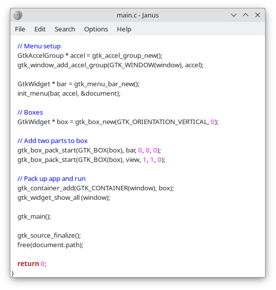
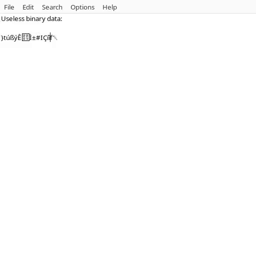

# Janus
Simple native linux notepad meant for text editing. Supports UTF-8 and binary data. 

## Features
- Undo/redo
- Similar keyinds to other text editors
- Spanish/French/German Translations
- Printing capabilities
- Optional syntax highlighting
- Binary editing

## Building

To build and install locally run:
```
meson build --buildtype release
ninja -C build
meson install -C build
```

To build as a deb package run:
```
meson build --buildtype release --prefix /usr
ninja -C build
DESTDIR=../janus-notepad_0.9.6-1 meson install -C build
install -Dm644 data/control janus-notepad_0.9.6-1/DEBIAN/control
dpkg-deb --root-owner-group -b janus-notepad_0.9.6-1
```

To build as AppImage run:
```
meson build --buildtype release --prefix /usr
ninja -C build
DESTDIR=../AppDir meson install -C build
appimage-builder --recipe data/AppImageBuilder.yml --appdir AppDir --build-dir /tmp
```

Janus depends on the following libraries for both building and running:
- Gtk3
- Gtksourceview4

## Installation

- [Arch Linux](https://aur.archlinux.org/packages/janus)
- [Debian](https://github.com/gholmann16/Janus/releases/latest)
- [AppImage](https://github.com/gholmann16/Janus/releases/latest)

## Screenshot


## Binary modification

Unlike most other simple text editors, binary editing is supported directly, rather than dealing with a codepage. When opened, Janus will display nondisplayable bytes as there unicode equivalent: for example 0xe3 will map to U+e3. To edit binaries, simply open them in Janus, then use Control + Shift + U to enter in new characters (From 0x01 to 0xFF). To enter a null character use U+2400. Once you save the file, Janus will convert these raw characters into hex data.

## Binary mode demo

