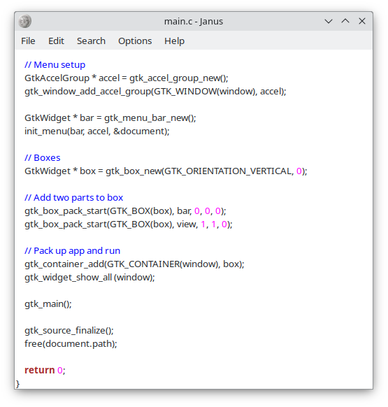
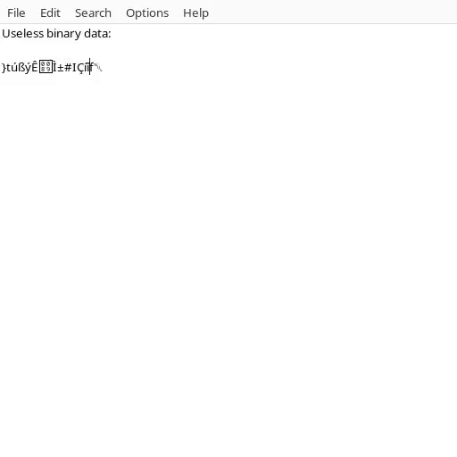

# Janus
Janus is a simple, native linux text editor. Supports UTF-8 and binary data through its fallback binary editing mode. Spiritual successor to leafpad. Intended to be as small and efficient as possible, trading features for a smaller impact on cpu.

## Features
- Undo/redo
- Similar keybinds to other text editors (e.g. leafpad)
- Spanish/French/German Translations
- Printing capabilities
- Optional syntax highlighting
- Fallback binary editing
- GVFS connectivity

## Building

To build and install locally run:
```sh
meson build --buildtype release
ninja -C build
meson install -C build
```

To uninstall it run: (if ninja has such functionality on your system)
```sh
sudo ninja -C build uninstall
```

To build as Flatpak run:
```sh
flatpak-builder --user --install --force-clean flatpak/ data/dev.pantheum.janus.yml
```

Janus depends on the following libraries for both building and running:
- GTK3
- GtkSourceView4

## Installation

- [Arch Linux](https://aur.archlinux.org/packages/janus)
- [Debian](https://github.com/gholmann16/Janus/releases/latest)
- [RHEL](https://github.com/gholmann16/Janus/releases/latest)
- [AppImage](https://appimage.github.io/janus)
- [Flatpak](https://flathub.org/apps/dev.pantheum.janus)

## Screenshot


## Binary modification

Unlike most other simple text editors, binary editing is supported directly as a fallback, rather than dealing with a codepage. When opened, Janus will display nondisplayable bytes as their unicode equivalent: for example 0xe3 will map to U+e3. To edit binaries, simply open them in Janus, then use Control + Shift + U to enter in new characters (From 0x01 to 0xFF). To enter a null character use U+2400. Once you save the file, Janus will convert these raw characters into hex data.

## Binary mode demo

